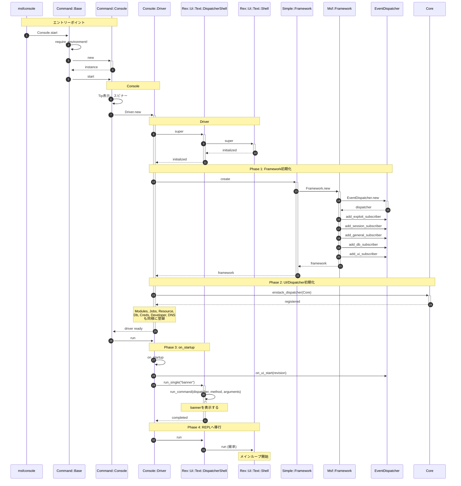
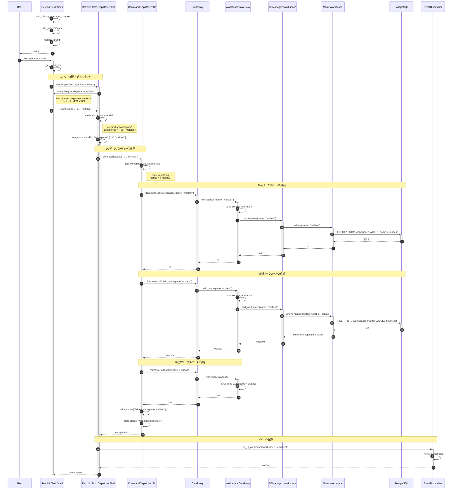
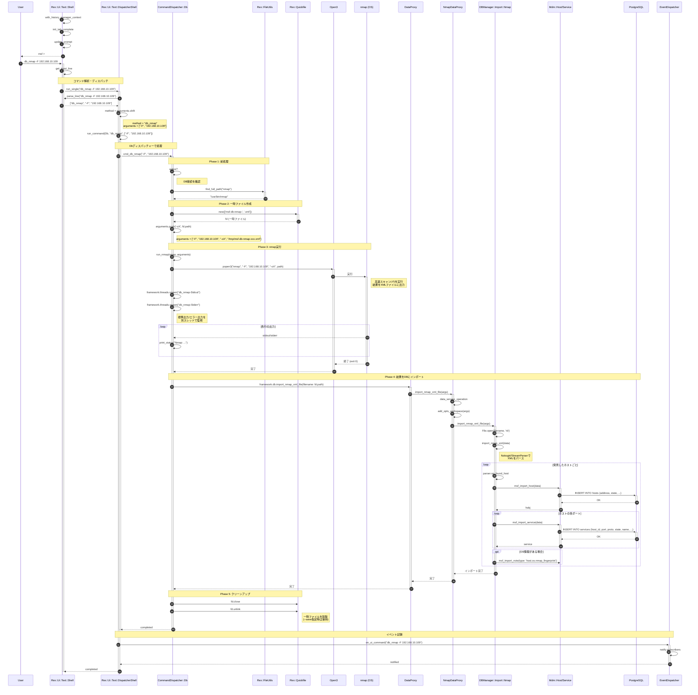
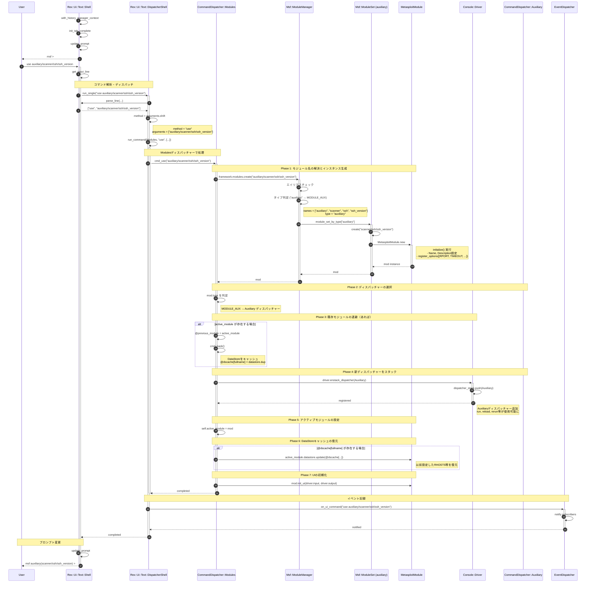
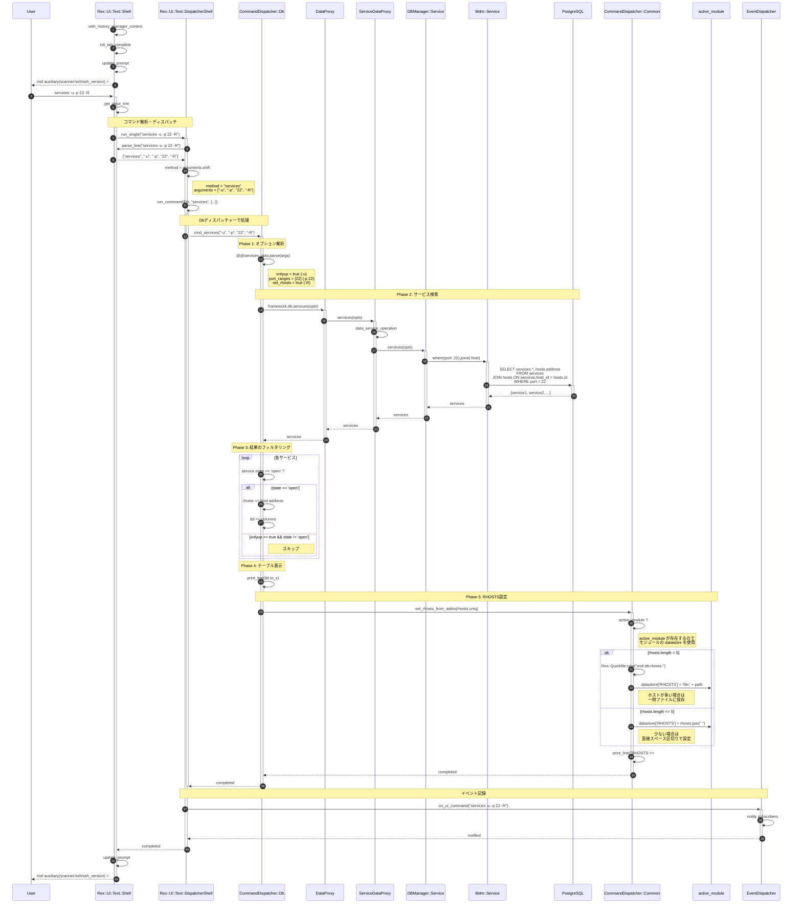
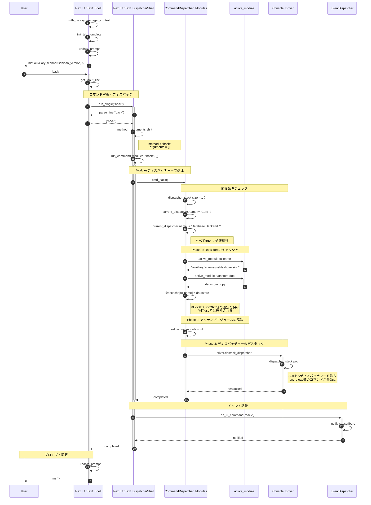
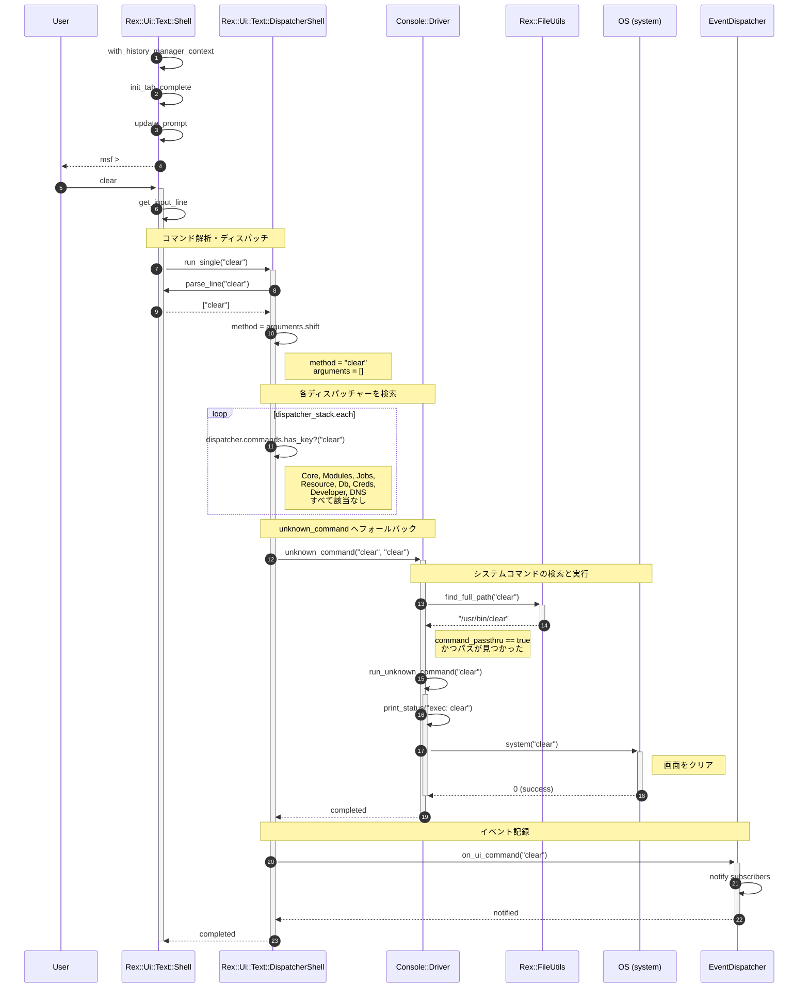
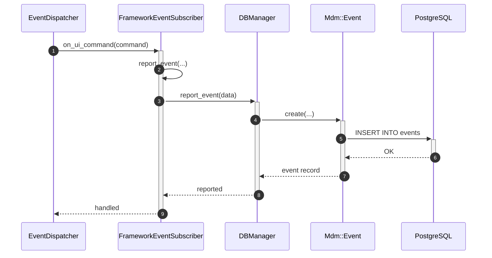

# msfconsole 内部動作

msfconsoleの起動からメインループ（REPL）までの処理フローを示すシーケンス図です。

## 起動シーケンス図



## コマンド実行例: workspace -a msftest

`workspace -a msftest` コマンドを入力した時の具体的な処理フローを示すシーケンス図です。



### 処理の流れ

1. **コマンド解析**: `DispatcherShell` が入力を解析し、`Db` ディスパッチャーの `cmd_workspace` を呼び出す
2. **オプション解析**: `@@workspace_opts.parse` で `-a` オプションを検出し `state = :adding` に設定
3. **既存確認**: `framework.db.workspaces(name: "msftest")` で既存ワークスペースを検索
4. **Proxyチェーン**: `DataProxy` → `WorkspaceDataProxy` → `DBManager::Workspace` → `Mdm::Workspace`
5. **DB操作**: `Mdm::Workspace.where(name: opts[:name]).first_or_create` で新規作成
6. **状態更新**: `WorkspaceDataProxy` の `@current_workspace` に新しいワークスペースを設定
7. **イベント記録**: `EventDispatcher` 経由でコマンド実行をDBに記録

### 関連ソース

- [cmd_workspace](../lib/msf/ui/console/command_dispatcher/db.rb#L113) - workspaceコマンドの実装
- [WorkspaceDataProxy](../lib/metasploit/framework/data_service/proxy/workspace_data_proxy.rb) - Proxyレイヤー
- [DBManager::Workspace#add_workspace](../lib/msf/core/db_manager/workspace.rb#L7) - ワークスペース追加

## コマンド実行例: db_nmap -F 192.168.10.109

`db_nmap -F 192.168.10.109` コマンドを入力した時の処理フローを示すシーケンス図です。`db_nmap` はnmapを実行し、結果をデータベースにインポートします。



### 処理の流れ

1. **コマンド解析**: `DispatcherShell` が入力を解析し、`Db` ディスパッチャーの `cmd_db_nmap` を呼び出す
2. **DB接続確認**: `active?` でデータベース接続を確認
3. **nmapパス検索**: `Rex::FileUtils.find_full_path("nmap")` でnmap実行ファイルを検索
4. **一時ファイル作成**: `Rex::Quickfile.new` でXML出力用の一時ファイルを作成
5. **引数構築**: `-oX /tmp/msf-db-nmap-xxx.xml` を引数に追加
6. **nmap実行**: `Open3.popen3` でnmapを子プロセスとして実行、stdout/stderrを別スレッドで監視
7. **XMLインポート**: `framework.db.import_nmap_xml_file` でスキャン結果をDBにインポート
8. **Proxyチェーン**: `DataProxy` → `NmapDataProxy` → `DBManager::Import::Nmap`
9. **XMLパース**: Nokogiri/StreamParserでXMLをパースし、ホスト・サービス情報を抽出
10. **ホスト登録**: `msf_import_host` で発見したホストを `hosts` テーブルに登録
11. **サービス登録**: `msf_import_service` で各ポートを `services` テーブルに登録
12. **クリーンアップ**: 一時ファイルを削除（`--save` 指定時は保持）
13. **イベント記録**: `EventDispatcher` 経由でコマンド実行をDBに記録

### -F オプション（高速スキャン）

`-F` は nmap の「Fast scan」オプションで、スキャン対象のポート数を削減して高速化します。

| モード | スキャン対象ポート数 | 説明 |
|--------|---------------------|------|
| デフォルト | 上位 1,000 ポート | `nmap 192.168.10.109` |
| `-F` | 上位 100 ポート | `nmap -F 192.168.10.109` |

### nmap実行時の特殊処理

- **root権限エスカレーション**: stderrに "requires root privileges" が含まれる場合、自動的に `sudo` 付きで再実行
- **Cygwin対応**: Cygwin環境ではパスをWin32形式に変換

## コマンド実行例: use auxiliary/scanner/ssh/ssh_version

`use auxiliary/scanner/ssh/ssh_version` コマンドを入力した時の処理フローを示すシーケンス図です。`use` コマンドはモジュールをロードし、モジュール専用のコマンドディスパッチャーをスタックに追加します。



### 処理の流れ

1. **コマンド解析**: `DispatcherShell` が入力を解析し、`Modules` ディスパッチャーの `cmd_use` を呼び出す
2. **モジュールインスタンス生成**: [`ModuleManager#create`](../lib/msf/core/module_manager.rb#L51) が以下を実行:
   - エイリアステーブルをチェック
   - タイプを判定（"auxiliary" → `MODULE_AUX`）
   - 該当する `ModuleSet` から `create` を呼び出し
   - `MetasploitModule` クラスをインスタンス化
3. **ディスパッチャー選択**: モジュールタイプに応じて `Auxiliary` ディスパッチャーを選択
4. **既存モジュールの退避**: アクティブモジュールがあれば `@previous_module` に保存し、DataStoreをキャッシュ
5. **ディスパッチャーのスタック**: `driver.enstack_dispatcher(Auxiliary)` で専用コマンドを追加
6. **アクティブモジュール設定**: `self.active_module = mod`
7. **DataStore復元**: 以前使用時のオプション設定を復元
8. **UI初期化**: モジュールに入出力を接続
9. **プロンプト更新**: `msf auxiliary(scanner/ssh/ssh_version) >` に変更

### ディスパッチャースタックの変化

```
use 実行前:                      use 実行後:
┌─────────────────┐             ┌─────────────────┐
│ Modules         │             │ Auxiliary       │ ← 新規追加
├─────────────────┤             ├─────────────────┤
│ Core            │             │ Modules         │
├─────────────────┤             ├─────────────────┤
│ Db, Creds, etc. │             │ Core            │
└─────────────────┘             ├─────────────────┤
                                │ Db, Creds, etc. │
                                └─────────────────┘
```

### Auxiliaryディスパッチャーで追加されるコマンド

| コマンド | 説明 |
|---------|------|
| `run` | モジュールを実行 |
| `exploit` | `run` のエイリアス |
| `reload` | モジュールをリロード |
| `rerun` | リロードして実行 |
| `rexploit` | `rerun` のエイリアス |
| `rcheck` | リロードしてチェック |

### DataStoreキャッシュの仕組み

```ruby
# back時: オプションをキャッシュ
@dscache[active_module.fullname] = active_module.datastore.dup

# use時: キャッシュからオプションを復元
if @dscache[active_module.fullname]
  active_module.datastore.update(@dscache[active_module.fullname])
end
```

→ 一度設定した `RHOSTS`, `RPORT` 等は `back` → `use` しても保持される

### 関連ソース

- [cmd_use](../lib/msf/ui/console/command_dispatcher/modules.rb#L786) - useコマンドの実装
- [cmd_back](../lib/msf/ui/console/command_dispatcher/modules.rb#L1122) - backコマンドの実装
- [cmd_previous](../lib/msf/ui/console/command_dispatcher/modules.rb#L921) - previousコマンドの実装
- [ModuleManager#create](../lib/msf/core/module_manager.rb#L51) - モジュールインスタンス生成
- [Auxiliary dispatcher](../lib/msf/ui/console/command_dispatcher/auxiliary.rb) - Auxiliary専用コマンド
- [ssh_version.rb](../modules/auxiliary/scanner/ssh/ssh_version.rb) - モジュール本体

## コマンド実行例: services -u -p 22 -R（use auxiliary/scanner/ssh/ssh_version の後）

前節の `use auxiliary/scanner/ssh/ssh_version` を実行した後に `services -u -p 22 -R` コマンドを入力した時の処理フローを示すシーケンス図です。このコマンドは、データベースからポート22でUP状態のサービスを検索し、結果をアクティブモジュールの `RHOSTS` オプションに設定します。



### 処理の流れ

1. **コマンド解析**: [`DispatcherShell`](../lib/rex/ui/text/dispatcher_shell.rb#L513) が入力を解析し、`Db` ディスパッチャーの [`cmd_services`](../lib/msf/ui/console/command_dispatcher/db.rb#L842) を呼び出す
2. **オプション解析**: `@@services_opts.parse` でオプションを解析:
   - `-u`: `onlyup = true`（UP状態のみ）
   - `-p 22`: `port_ranges = [22]`（ポート22）
   - `-R`: `set_rhosts = true`（RHOSTSに設定）
3. **Proxyチェーン**: `DataProxy` → `ServiceDataProxy` → `DBManager::Service` → `Mdm::Service`
4. **DB検索**: `services` テーブルからポート22のサービスを検索
5. **フィルタリング**: `onlyup = true` なので `state == 'open'` のサービスのみ抽出
6. **テーブル表示**: 検索結果をテーブル形式で表示
7. **RHOSTS設定**: [`set_rhosts_from_addrs`](../lib/msf/ui/console/command_dispatcher/common.rb#L72) でアクティブモジュールの `datastore['RHOSTS']` に設定
8. **イベント記録**: `EventDispatcher` 経由でコマンド実行をDBに記録

### オプションの説明

| オプション | 説明 |
|-----------|------|
| `-u` | UP状態（`state == 'open'`）のサービスのみ表示 |
| `-p 22` | ポート22のサービスのみ表示 |
| `-R` | 検索結果のホストアドレスをRHOSTSに設定 |

### RHOSTS設定の分岐

```ruby
# lib/msf/ui/console/command_dispatcher/common.rb:72-99
def set_rhosts_from_addrs(rhosts)
  if active_module
    mydatastore = active_module.datastore  # モジュールのDataStore
  else
    mydatastore = self.framework.datastore  # グローバルDataStore
  end

  if rhosts.length > 5
    # ホストが多い場合はファイルに保存
    rhosts_file = Rex::Quickfile.new("msf-db-rhosts-")
    mydatastore['RHOSTS'] = 'file:' + rhosts_file.path
    rhosts_file.write(rhosts.join("\n") + "\n")
  else
    # 少ない場合は直接設定
    mydatastore['RHOSTS'] = rhosts.join(" ")
  end
end
```

### 実行例

```bash
msf auxiliary(scanner/ssh/ssh_version) > services -u -p 22 -R

Services
========

host            port  proto  name  state  info
----            ----  -----  ----  -----  ----
192.168.10.101  22    tcp    ssh   open   OpenSSH 8.2
192.168.10.102  22    tcp    ssh   open   OpenSSH 7.9
192.168.10.109  22    tcp    ssh   open   OpenSSH 8.4

RHOSTS => 192.168.10.101 192.168.10.102 192.168.10.109

msf auxiliary(scanner/ssh/ssh_version) > run
[*] 192.168.10.101:22 - SSH server version: SSH-2.0-OpenSSH_8.2 ...
```

### 関連ソース

- [cmd_services](../lib/msf/ui/console/command_dispatcher/db.rb#L842) - servicesコマンドの実装
- [set_rhosts_from_addrs](../lib/msf/ui/console/command_dispatcher/common.rb#L72) - RHOSTS設定
- [ServiceDataProxy](../lib/metasploit/framework/data_service/proxy/service_data_proxy.rb) - Proxyレイヤー
- [DBManager::Service#services](../lib/msf/core/db_manager/service.rb#L129) - サービス検索

## コマンド実行例: back（use auxiliary/scanner/ssh/ssh_version の後）

前節の `use auxiliary/scanner/ssh/ssh_version` を実行した後に `back` コマンドを入力した時の処理フローを示すシーケンス図です。`back` コマンドはモジュールコンテキストを抜けて、グローバルコンテキストに戻ります。



### 処理の流れ

1. **コマンド解析**: [`DispatcherShell`](../lib/rex/ui/text/dispatcher_shell.rb#L513) が入力を解析し、`Modules` ディスパッチャーの [`cmd_back`](../lib/msf/ui/console/command_dispatcher/modules.rb#L1122) を呼び出す
2. **前提条件チェック**: 以下をすべて確認:
   - `dispatcher_stack.size > 1` （スタックに複数のディスパッチャーがある）
   - `current_dispatcher.name != 'Core'` （Coreディスパッチャーではない）
   - `current_dispatcher.name != 'Database Backend'` （DBバックエンドではない）
3. **DataStoreのキャッシュ**: `@dscache[fullname]` にオプション設定を保存
4. **アクティブモジュールの解除**: `self.active_module = nil`
5. **ディスパッチャーのデスタック**: `driver.destack_dispatcher` でモジュール専用ディスパッチャーを除去
6. **イベント記録**: `EventDispatcher` 経由でコマンド実行をDBに記録
7. **プロンプト更新**: `msf >` に戻る

### ディスパッチャースタックの変化

```
back 実行前:               back 実行後:
┌─────────────────┐       ┌─────────────────┐
│ Auxiliary       │ ─────→│ Modules         │  ※ Auxiliary を除去
├─────────────────┤       ├─────────────────┤
│ Modules         │       │ Core            │
├─────────────────┤       ├─────────────────┤
│ Core            │       │ Db, Creds, etc. │
├─────────────────┤       └─────────────────┘
│ Db, Creds, etc. │
└─────────────────┘
```

### DataStoreキャッシュの効果

```bash
msf > use auxiliary/scanner/ssh/ssh_version
msf auxiliary(scanner/ssh/ssh_version) > set RHOSTS 192.168.10.109
msf auxiliary(scanner/ssh/ssh_version) > set THREADS 10
msf auxiliary(scanner/ssh/ssh_version) > back
msf >
# ... 他の作業 ...
msf > use auxiliary/scanner/ssh/ssh_version
msf auxiliary(scanner/ssh/ssh_version) > show options
# → RHOSTS=192.168.10.109, THREADS=10 が復元されている
```

### backできない場合

以下の場合は `back` コマンドは何もしません:

- `dispatcher_stack.size == 1` （グローバルコンテキストにいる）
- `current_dispatcher.name == 'Core'` （Coreディスパッチャー）
- `current_dispatcher.name == 'Database Backend'` （DBバックエンド）

### 関連ソース

- [cmd_back](../lib/msf/ui/console/command_dispatcher/modules.rb#L1122) - backコマンドの実装
- [destack_dispatcher](../lib/rex/ui/text/dispatcher_shell.rb) - ディスパッチャー除去

## コマンド実行例: clear

`clear` コマンドを入力した時の処理フローを示すシーケンス図です。`clear` はMetasploit内部のコマンドではなく、システムコマンドとして実行されます。



### 処理の流れ

1. **コマンド解析**: `parse_line("clear")` で `["clear"]` に分解
2. **ディスパッチャー検索**: 全ディスパッチャー（Core, Modules, Jobs, Resource, Db, Creds, Developer, DNS）の `commands` をチェック → 該当なし
3. **unknown_command**: `Driver#unknown_command` が呼ばれる
4. **パス検索**: `Rex::FileUtils.find_full_path("clear")` でシステム上の `clear` コマンドを検索
5. **システムコマンド実行**: `system("clear")` で OS の clear コマンドを実行
6. **イベント記録**: `EventDispatcher` 経由でコマンド実行をDBに記録

### 関連ソース

- [Driver#unknown_command](../lib/msf/ui/console/driver.rb#L523) - 未知コマンドの処理
- [Driver#run_unknown_command](../lib/msf/ui/console/driver.rb#L555) - システムコマンド実行
- [Rex::FileUtils.find_full_path](../lib/rex/file_utils.rb) - コマンドパス検索

## 各フェーズの説明

### Phase 1: Framework初期化

- [EventDispatcher](../lib/msf/core/event_dispatcher.rb#L17)、[ModuleManager](../lib/msf/core/module_manager.rb#L17)、[DataStore](../lib/msf/core/data_store.rb#L10)等のコンポーネントを初期化

### Phase 2: UI/Dispatcher初期化

- シェル（入出力、プロンプト、タブ補完）を初期化
- コマンドディスパッチャーを登録（[driver.rb#L26](../lib/msf/ui/console/driver.rb#L26)）:
  1. [**Core**](../lib/msf/ui/console/command_dispatcher/core.rb) - 基本コマンド（`use`, `set`, `show`, `info`, `banner`等）
  2. [**Modules**](../lib/msf/ui/console/command_dispatcher/modules.rb) - モジュール管理（`search`, `reload`, `loadpath`等）
  3. [**Jobs**](../lib/msf/ui/console/command_dispatcher/jobs.rb) - ジョブ管理（`jobs`, `kill`等）
  4. [**Resource**](../lib/msf/ui/console/command_dispatcher/resource.rb) - リソーススクリプト（`resource`, `makerc`等）
  5. [**Db**](../lib/msf/ui/console/command_dispatcher/db.rb) - データベース操作（`workspace`, `db_status`, `hosts`, `services`, `vulns`等）
  6. [**Creds**](../lib/msf/ui/console/command_dispatcher/creds.rb) - 認証情報管理（`creds`等）
  7. [**Developer**](../lib/msf/ui/console/command_dispatcher/developer.rb) - 開発者向け（`edit`, `reload_lib`, `log`等）
  8. [**DNS**](../lib/msf/ui/console/command_dispatcher/dns.rb) - DNS設定（`dns`等）
- `framework.db`（[DataProxy](../lib/metasploit/framework/data_service/proxy/core.rb#L11)）に初回アクセスしDB接続をチェック

### Phase 3: Module/Configロード

- モジュールパスを初期化（`framework.init_module_paths`）
- 別スレッドでモジュールキャッシュを更新（`ModuleCacheRebuild`）
- コンソール設定をロード
- [`on_startup`](../lib/msf/ui/console/driver.rb#L364)処理:
  - モジュールロードエラー/警告の確認
  - ワークスペース設定
  - バナー表示（`run_single("banner")`）

**Banner表示**:

[`cmd_banner`](../lib/msf/ui/console/command_dispatcher/core.rb#L272):
- `run_single("banner")`により`Core`ディスパッチャーの`cmd_banner`が呼び出される
- [`Banner.to_s`](../lib/msf/ui/banner.rb#L39)でASCIIアートを取得
- `print_line(banner)`で出力

**起動後処理**:
- デフォルトリソーススクリプト（`~/.msf4/msfconsole.rc`）を実行
- 永続ハンドラーを復元
- 起動時コマンド（`-x`オプション）を実行

### Phase 4: メインループ (REPL)

[`Rex::Ui::Text::Shell#run`](../lib/rex/ui/text/shell.rb#L124)がRead-Eval-Print Loopを開始:

1. 履歴マネージャーコンテキストを設定
2. 無限ループ開始:
   - タブ補完を初期化
   - プロンプトを更新
   - ユーザー入力を待機（[`get_input_line`](../lib/rex/ui/text/shell.rb#L324)）
   - コマンドを実行（`run_single`）
3. `Ctrl+C`で中断した場合は継続
4. `quit`/`exit`またはEOFで終了

## イベント記録

msfconsoleの操作はデータベースの`events`テーブルに記録される。

### 記録されるイベント

| イベント名 | 発生タイミング |
|-----------|---------------|
| `ui_start` | msfconsole起動時 |
| `ui_stop` | msfconsole終了時 |
| `ui_command` | コマンド実行時 |
| `module_run` | モジュール実行開始 |
| `module_complete` | モジュール実行完了 |
| `module_error` | モジュールエラー |
| `session_open` | セッション確立時 |

### 処理の流れ



### 関連ソース

- [FrameworkEventSubscriber](../lib/msf/core/framework.rb#L320) - イベント購読・記録
- [report_event](../lib/msf/core/db_manager/event.rb#L52) - DB書き込み
