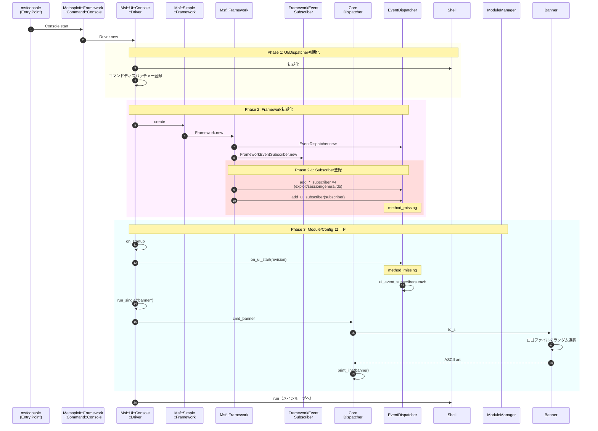
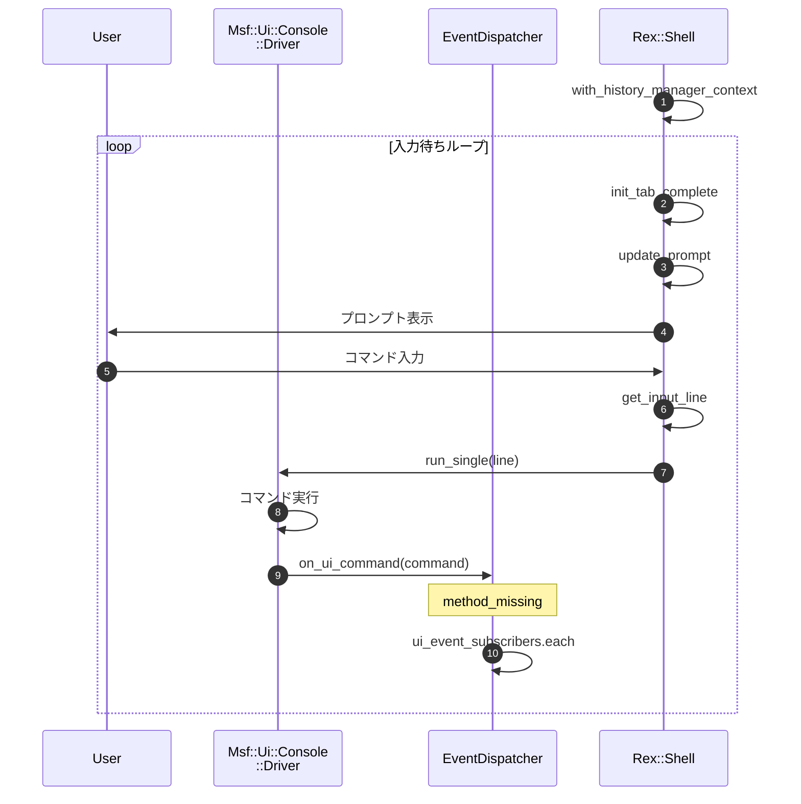
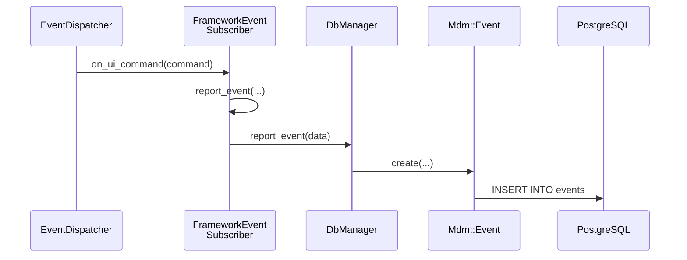

# msfconsole 内部動作

msfconsoleの起動からメインループ（REPL）までの処理フローを示すシーケンス図です。

## 起動シーケンス

## メインループ (REPL)

## 各フェーズの説明

### Phase 1: UI/Dispatcher初期化

- シェル（入出力、プロンプト、タブ補完）を初期化
- コマンドディスパッチャーを登録（[driver.rb#L26](../lib/msf/ui/console/driver.rb#L26)）:
  1. [**Core**](../lib/msf/ui/console/command_dispatcher/core.rb) - 基本コマンド（`use`, `set`, `show`, `info`, `banner`等）
  2. [**Modules**](../lib/msf/ui/console/command_dispatcher/modules.rb) - モジュール管理（`search`, `reload`, `loadpath`等）
  3. [**Jobs**](../lib/msf/ui/console/command_dispatcher/jobs.rb) - ジョブ管理（`jobs`, `kill`等）
  4. [**Resource**](../lib/msf/ui/console/command_dispatcher/resource.rb) - リソーススクリプト（`resource`, `makerc`等）
  5. [**Db**](../lib/msf/ui/console/command_dispatcher/db.rb) - データベース操作（`workspace`, `db_status`, `hosts`, `services`, `vulns`等）
  6. [**Creds**](../lib/msf/ui/console/command_dispatcher/creds.rb) - 認証情報管理（`creds`等）
  7. [**Developer**](../lib/msf/ui/console/command_dispatcher/developer.rb) - 開発者向け（`edit`, `reload_lib`, `log`等）
  8. [**DNS**](../lib/msf/ui/console/command_dispatcher/dns.rb) - DNS設定（`dns`等）

### Phase 2: Framework初期化

- [EventDispatcher](../lib/msf/core/event_dispatcher.rb#L17)、[ModuleManager](../lib/msf/core/module_manager.rb#L17)、[DataStore](../lib/msf/core/data_store.rb#L10)等のコンポーネントを初期化

### Phase 3: Module/Configロード

- モジュールパスを初期化（`framework.init_module_paths`）
- 別スレッドでモジュールキャッシュを更新（`ModuleCacheRebuild`）
- コンソール設定をロード
- [`on_startup`](../lib/msf/ui/console/driver.rb#L364)処理:
  - モジュールロードエラー/警告の確認
  - ワークスペース設定
  - バナー表示（`run_single("banner")`）

**Banner表示**:

[`cmd_banner`](../lib/msf/ui/console/command_dispatcher/core.rb#L272):
- `run_single("banner")`により`Core`ディスパッチャーの`cmd_banner`が呼び出される
- [`Banner.to_s`](../lib/msf/ui/banner.rb#L39)でASCIIアートを取得
- `print_line(banner)`で出力

**起動後処理**:
- デフォルトリソーススクリプト（`~/.msf4/msfconsole.rc`）を実行
- 永続ハンドラーを復元
- 起動時コマンド（`-x`オプション）を実行

### Phase 4: メインループ (REPL)

[`Rex::Ui::Text::Shell#run`](../lib/rex/ui/text/shell.rb#L124)がRead-Eval-Print Loopを開始:

1. 履歴マネージャーコンテキストを設定
2. 無限ループ開始:
   - タブ補完を初期化
   - プロンプトを更新
   - ユーザー入力を待機（[`get_input_line`](../lib/rex/ui/text/shell.rb#L324)）
   - コマンドを実行（`run_single`）
3. `Ctrl+C`で中断した場合は継続
4. `quit`/`exit`またはEOFで終了

## イベント記録

msfconsoleの操作はデータベースの`events`テーブルに記録される。

### 記録されるイベント

| イベント名 | 発生タイミング |
|-----------|---------------|
| `ui_start` | msfconsole起動時 |
| `ui_stop` | msfconsole終了時 |
| `ui_command` | コマンド実行時 |
| `module_run` | モジュール実行開始 |
| `module_complete` | モジュール実行完了 |
| `module_error` | モジュールエラー |
| `session_open` | セッション確立時 |

### 処理の流れ

### 関連ソース

- [FrameworkEventSubscriber](../lib/msf/core/framework.rb#L320) - イベント購読・記録
- [report_event](../lib/msf/core/db_manager/event.rb#L52) - DB書き込み